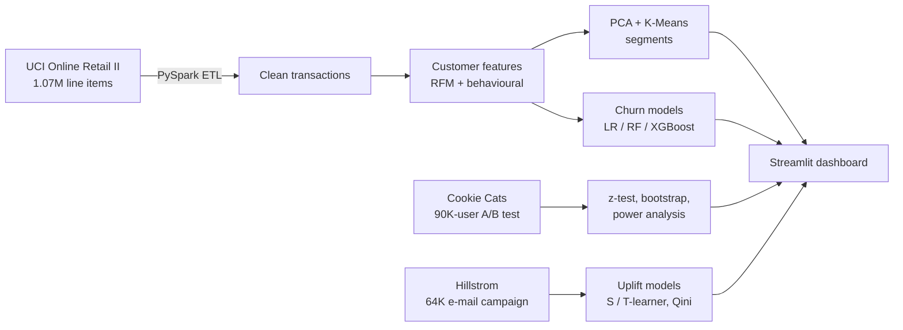
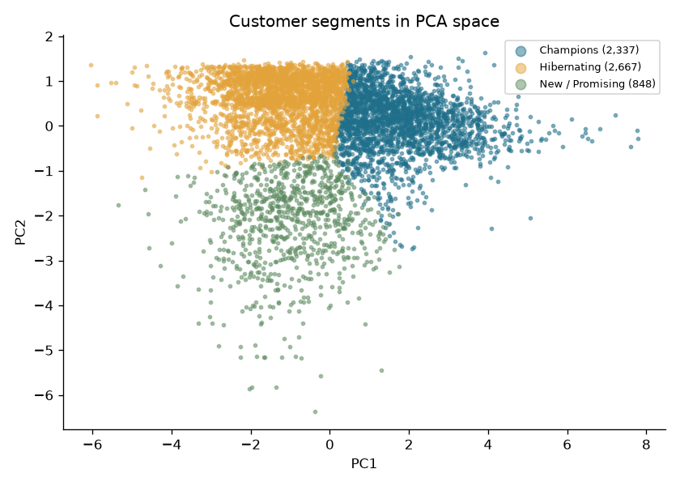
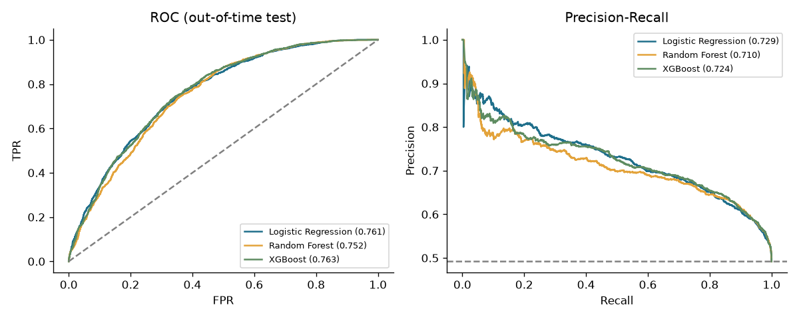
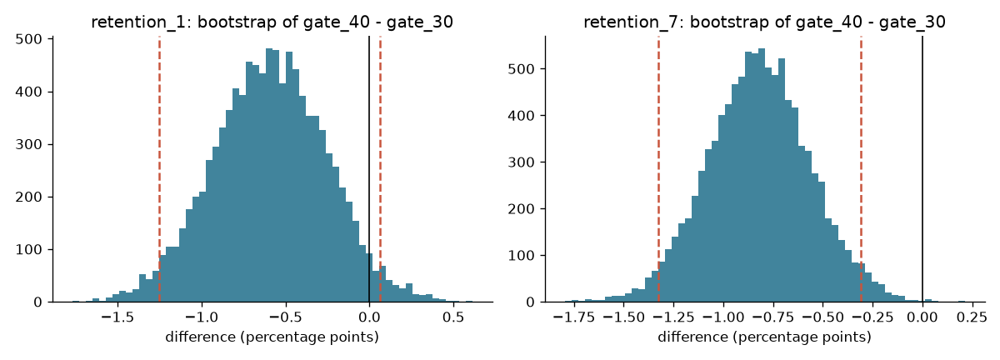
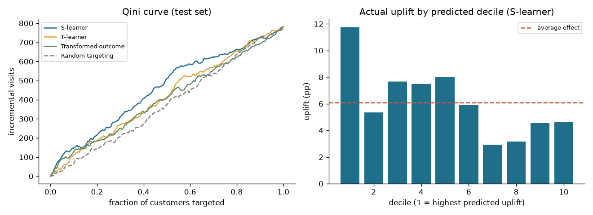

# Client Retention Analytics & Experimentation Platform

End-to-end retention analytics: a **PySpark** pipeline over 1M+ e-commerce transaction records, customer **segmentation** (RFM + PCA + K-Means), **churn prediction** (Logistic Regression / Random Forest / XGBoost), a rigorous **A/B test** analysis (hypothesis tests, bootstrap CIs, power analysis), and **uplift modelling** to decide who a retention campaign should target. The results are served in a **Streamlit** dashboard.

> The question this project answers: *Which customers are about to leave, which of them are worth saving, and does our intervention actually change their behaviour?*



## Quick start

PySpark needs Java 17+. The simplest way to get Python and Java together is a conda environment:

```bash
conda create -n retention --override-channels -c conda-forge python=3.11 openjdk=17 xgboost llvm-openmp -y
conda activate retention
pip install -r requirements.txt
```

Then:

```bash
python data/download_data.py             # or place the 3 files manually (data/README.md)
python run_all.py                        # runs steps 1-6, ~3-10 min
streamlit run app/app.py                 # dashboard
```

`python run_all.py --from 2` skips the Spark step once it has run. `--only 4` runs just the A/B test.

**No Java or on Windows? Use Google Colab.** Upload the project folder and the data, then:

```python
!pip install pyspark xgboost statsmodels shap
%cd /content/retention-analytics
!python run_all.py
```

Download `outputs/` and `data/processed/` back into your local copy, and the dashboard runs locally without Spark.

## Project structure

```
src/
  config.py              every parameter (cutoffs, horizons, k range, alpha, ...)
  01_spark_etl.py        PySpark: clean -> customer features -> churn labels -> cohorts
  02_segmentation.py     log + scale -> PCA -> K-Means, business-named segments
  03_churn_model.py      LR / RF / XGBoost, out-of-time test, lift, importance, live scoring
  04_ab_test.py          SRM, z-test, bootstrap, Holm, MDE / power, guardrail metric
  05_uplift.py           S-learner, T-learner, transformed outcome; Qini, uplift@k
  06_make_report.py      writes outputs/REPORT.md with every number
app/app.py               Streamlit dashboard (reads outputs/ only)
```

## Methodology and key decisions

### 1. PySpark ETL
The raw data has about 1.07M **line items** (one row per product per invoice), which make up roughly 50K invoices. The cleaning steps are logged with row counts in `outputs/etl_report.json`. They are:

1. Drop exact duplicates. The two UCI sheets overlap in December 2010.
2. Drop rows without a Customer ID (guest checkouts can't be tracked for retention).
3. Drop rows with non-positive prices.
4. Drop non-product stock codes such as postage, bank charges, and manual adjustments.
5. Treat invoices starting with "C" as returns. These are kept as a feature, not as purchases.

Spark does the heavy aggregation (about 1M rows down to about 5.9K customers). Modelling then happens in scikit-learn, because the customer table is small.

### 2. Segmentation
RFM variables are heavily right-skewed, so they are log-transformed and standardised first. PCA then keeps 90% of the variance and removes correlation between features (frequency and monetary value move together). K-Means is run for k = 2–8. k is chosen by silhouette score within 3–7, because k = 2 ("good vs bad") rarely helps a marketing team. Clusters are then named from their median recency, frequency, and spend relative to the whole customer base.

### 3. Churn model
- **Label definition.** The data has no churn column. A customer who bought in the previous 365 days has churned if they make **no purchase in the next 90 days** after a cutoff date.
- **Leakage control.** Features use only data from *before* the cutoff.
- **Out-of-time validation.** The model trains on the snapshot at `2011-03-13` and is tested on the snapshot at `2011-09-11`. A random split would test the model on the same period it trained on and would overstate performance.
- **Tuning without peeking.** Hyperparameters (randomised search) and the decision threshold are chosen with 5-fold CV on the training data only.
- **Metrics.** Reported metrics are ROC-AUC, PR-AUC, Brier score, and **capture and lift in the top 20%**, which is what a retention team with a limited budget actually uses. There is also a **recency-only baseline**, so the ML has to beat a simple rule.
- **Explanations.** Permutation importance is computed for all models, plus SHAP when it is installed.
- **Scoring today's customers.** The best model is refit on all labelled data and scores the current customer base. The dashboard shows the resulting list, filterable by risk band and segment.

### 4. A/B test
Cookie Cats moved the first gate from level 30 to level 40. The analysis steps are:

1. **Sample-ratio mismatch** check (chi-square). If the split is broken, nothing downstream can be trusted.
2. **Two-proportion z-test** with a Wald CI for 1-day and 7-day retention.
3. **Bootstrap** CI and p-value, which serve as a distribution-free check. Resampling Bernoulli outcomes is exactly a binomial draw, so 10K resamples take milliseconds.
4. **Holm correction**, because there are two primary metrics.
5. **Power analysis**. This gives the minimum detectable effect at 80% power for this sample, and the sample size that would be needed for the observed effect.
6. **Guardrail metric** (game rounds). This metric is heavy-tailed, and one player logged about 50K rounds, so it uses Mann-Whitney U and a bootstrap of the median instead of a t-test.

### 5. Uplift modelling
A churn score ranks customers by *risk*. A campaign only pays off on customers whose behaviour it *changes*: the Persuadables. It wastes money on Sure Things (would stay anyway) and Lost Causes, and it can backfire on Sleeping Dogs. The Hillstrom data comes from a randomised e-mail test and has only pre-treatment features, so the conditional average treatment effect can be estimated. Three learners are compared:

- **S-learner:** one model with treatment as a feature.
- **T-learner:** separate models for treated and control customers.
- **Transformed outcome:** Athey & Imbens.

They are evaluated on a held-out 30% with **Qini curves**, **uplift@k**, and **observed uplift by predicted decile**.

## Results
All numbers below are from `outputs/REPORT.md`, which the pipeline regenerates on every run. Figures are in [`outputs/figures/`](outputs/figures/).

### Data pipeline
1,067,371 raw line items clean down to **794,161** (Dec 2009 – Dec 2011): 5,875 customers, 43,876 invoices, 4,633 products, 41 countries. The biggest cut is 235K guest-checkout rows without a Customer ID.

### Segmentation
3 principal components keep 91.1% of the variance; silhouette picks k = 3 (0.369).

| Segment | % customers | % revenue | Median recency (days) | Median orders | Median spend (£) |
|---|---:|---:|---:|---:|---:|
| Champions | 39.9% | 88.7% | 32 | 8 | 2,855 |
| Hibernating | 45.6% | 8.2% | 382 | 2 | 400 |
| New / Promising | 14.5% | 3.1% | 31 | 1 | 421 |



### Churn model (out-of-time test, Sep 2011 snapshot)
| Model | ROC-AUC | PR-AUC | Brier | Capture @ top 20% | Lift @ top 20% |
|---|---:|---:|---:|---:|---:|
| **Logistic Regression** | 0.761 | **0.729** | 0.198 | **31.4%** | **1.57x** |
| XGBoost | 0.763 | 0.724 | 0.198 | 30.8% | 1.54x |
| Random Forest | 0.752 | 0.710 | 0.205 | 30.2% | 1.51x |
| Recency-only rule (baseline) | 0.707 | 0.659 | – | – | – |

All three models beat the recency rule. The simpler logistic regression matches the tree models on this small customer table, so it is the one used to score the 4,261 currently active customers. The strongest drivers are months active, 90-day order frequency and spend, and tenure.



### A/B test (Cookie Cats, 90,189 players)
The sample-ratio check passes (p = 0.009 against the p < 0.001 alarm threshold).

| Metric | Gate 30 | Gate 40 | Diff | 95% bootstrap CI | p (Holm) |
|---|---:|---:|---:|---|---:|
| 1-day retention | 44.82% | 44.23% | −0.59 pp | [−1.25, +0.06] pp | 0.074 |
| 7-day retention | 19.02% | 18.20% | **−0.82 pp** | [−1.32, −0.31] pp | **0.003** |

**Decision: keep the gate at level 30.** Moving it to level 40 lowers 7-day retention by 4.3% relative, and the effect is larger than the 0.74 pp minimum detectable effect at 80% power.



### Uplift modelling (Hillstrom, 64,000 customers)
Any e-mail raises the visit rate by **+6.1 pp** on average [+5.1, +7.1]. Ranking customers by predicted uplift does better than mailing at random:

| Model | Qini coef. | Uplift in top 10% | Uplift in top 30% | Share of total gain from top 30% |
|---|---:|---:|---:|---:|
| **S-learner** | **0.0052** | **+11.8 pp** | **+8.2 pp** | **40%** |
| T-learner | 0.0021 | +8.6 pp | +7.1 pp | 35% |
| Transformed outcome | 0.0013 | +10.1 pp | +6.6 pp | 32% |
| Random targeting | −0.0007 | +5.0 pp | +5.4 pp | 27% |

Mailing only the top 30% by S-learner score captures 40% of the extra visits that mailing everyone would produce.



## Deploying the dashboard
Commit `outputs/` and `data/processed/` (both small), push to GitHub, and on share.streamlit.io set the main file to `app/app.py`. `app/requirements.txt` keeps the deployment light, with no Spark or XGBoost.

## Highlights
- PySpark pipeline over **1M+ e-commerce transaction records** (UCI Online Retail II): RFM and behavioural features, **PCA + K-Means** segmentation, and churn models (**Logistic Regression, Random Forest, XGBoost**) validated **out-of-time**. Best test PR-AUC **0.729** against 0.659 for a recency rule; the top 20% of scores captures **31%** of churners (1.57x lift).
- **90K-user retention A/B test** analysed with SRM checks, z-tests, **bootstrap CIs**, Holm correction, and **power analysis (MDE)**: moving the gate lowers 7-day retention by 0.82 pp (p = 0.003).
- **Uplift modelling** (S/T-learner, transformed outcome, Qini) on a 64K-customer e-mail campaign: targeting the top 30% captures **40%** of incremental visits.
- Results served in a **Streamlit** dashboard with a filterable "who to contact now" list.
